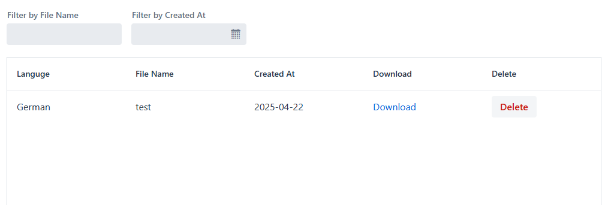

# Translate Audio
With this app you can upload English audio files and select a target language, and it will transform that audio into a translated transcript in your selected target language.

## How to use it
- Sign In
- Upload an audio file
- Select audio file and target language
- Press transform and sit back and relax
- Download translated transcript

**Settings Page** 

You can select your preferred target language in the settings page and now the app will automatically select it for you in the future.

**Transcripts Page**

You can view all your transcripts in the transcripts path.

# Setup
**Docker**: 
Make sure you have Docker installed, if you are on Windows you have to open Docker Desktop on the background. After that just run: `docker-compose up` on the command line in the directory where docker-compose.yml resides. This will take a while, because the image is quite large. When its ready it will spin up 2 containers, the app and the database that the app uses. Now you can go to 127.0.0.1:8080/ and the website should be up and running.

**Locally (Not recommended)**

The project is designed to be ran with docker. To run locally: You need to download python version 3.11.9, build enviroment with it and run `pip install -r requirements.txt`. You also need to install ffmpeg, because the project relies on it. After that you have to edit the AppConfig to point to the correct python executable and project root.

## Additional Notes
- **Original Plan**: I originally intented to build a pipeline which had three phases: transcript -> translation -> text-to-speech, but the text to audio models were too large to install locally and I decided against it.

- **Modular Design:** The project uses three Python modules (`transcribe.py`, `translate.py` and `tts.py`. Any of these python scripts can be changed like for example swapping out to different AI models and the app would work exactly the same.

- **Limitations:** Currently the audio/transcription files are stored on the app container itself. For production app you would need to store them somewhere else

- **Scalability Thoughts:** Running python scripts in the app container works for this prototypetype but isn't scalable. In a real app, you could split transcription, translation and tts into separatecontainers, chunk audio files for parallel processing, and recombine outputs.

## Technical Details
**Built with:** 
- Python 3.11.9
- JDK21
- Vaadin